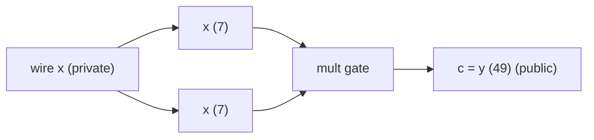
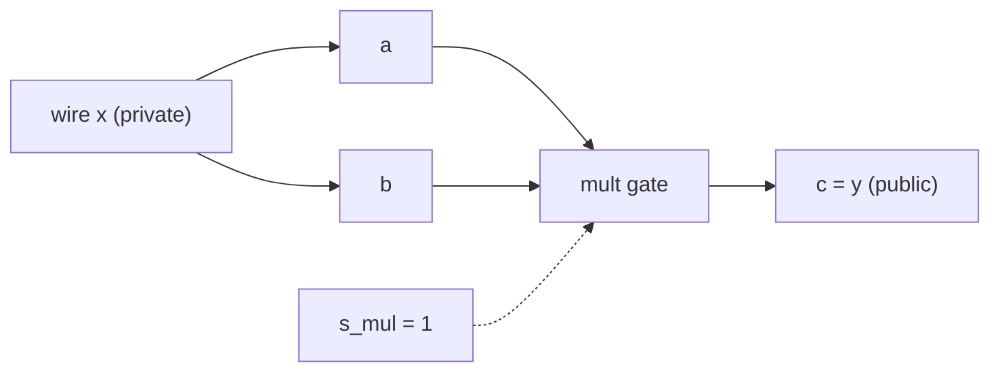

# WTF is PLONK

In this tutorial we're gonna cover how the ZK proof scheme PLONK works. We are going to prove the claim: we know `x` such that `x · x = y`, without revealing `x`. While this is a very simple example, it serves as a good starting point to understand the core concepts of PLONK.

---

## Part 1 — Computation as a table (execution trace and gate constraints)

First we represent our equation as a circuit, where each variable will become a wire.

For `x · x = y` (`x = 7`, `y = 49`), the circuit has two logical wires and one multiplication gate:



- `x` is private — the prover knows it, the verifier must not learn it
- `y` is public — the verifier supplies `49` and checks the proof against it

We can also organize this circuit in a more general/flexible way, using to follow the equation: 
- `x * x = y`
- `<-> a * b = c`
- `<-> a * b - c = 0`
- `<-> s_mul * (a * b - c) = 0`

Now we have a general multiplication gate representation where:
- `a` and `b` are two *cells* / *inputs* (which both carry wire `x`)
- `c` is the output (which carrys wire `y`) 
- and `s_mul` is the selector (a gate that enables/disables the rest of the equation, in our example it will always be enabled)

*Note:* the full PLONK uses a more sophisticated version of this equation to support other operations, but for learning purposes, understanding a single multiplication gate is a great starting place.

Our circuit now looks as follows:



We can also represent our circuit as a *computer trace* using a matrix where each row is the 'state' of the computer program over time, and the validness of each row is a *gate check*, for example:

| `s_mul` | `a` | `b` | `c` | gate check `s · (a·b − c)` |
|---------|-----|-----|-----|----------------------------|
| 1 | 7 | 7 | 49 | `1 · (7·7 − 49) = 0` ✓ |
| 0 | 0 | 0 | 0 | `0 · (anything) = 0` ✓ |
| 0 | 0 | 0 | 0 | `0 · (anything) = 0` ✓ |
| 0 | 0 | 0 | 0 | `0 · (anything) = 0` ✓ |

- Row 0 is the only active gate: it enforces `s_mul · (a · b) = c`, i.e. `7 · 7 = 49`
- Rows 1–3 are *padding*: `s_mul = 0` turns the gate off, so those values don't matter

*Note:* in our example, since we only have one gate/state, we only care about the first row (the other rows are `padded`) but notice it would support much more complicated computations

Using this matrix, the prover's claim is: **every row of the trace satisfies `s_mul · (a·b − c) = 0`**

To verify this, we can check each row's gate equality in a loop. Pretty straightforward.

## Part 2 — Identical wires must agree (copy constraints)

Notice in our equation `a` and `b` both represent the same variable, `x`, but we never validate this using gate checks.

To accomplish this we'll introduce something called 'copy constraints', which first defines which variables (`a` and `b`) need to be the same in the trace, and then validate it, alongside the gate check.

We'll define a `WIRE_IDS` variable as a flat N*M vector represeting our trace and its values define the 'wire id' of each value in the trace, for example:
  
| w_id_index | cell | wire ID | trace value | copy rule |
|-----------|------|---------|---------------------------|-----------|
| 0 | row 0, `a` | 0 (`x`, private) | 7 | must equal placement 1 |
| 1 | row 0, `b` | 0 (`x`, private) | 7 | must equal placement 0 |
| 2 | row 0, `c` | 1 (`y`, public) | 49 | must equal `public_inputs[0]` |
| 3–11 | padding rows | −1 (none) | 0 | no copy checks |

- Notice at `w_id_index` 0 and 1, `WIRE_IDS[w_id_index] = 0` so the flat trace at index `0` and `1` must hold the same. 
- Also, `w_id_index` 2 carries `y` so the verifier checks `public_inputs[0] == 49`. 

Without these checks, a dishonest prover could set `a = 7`, `b = 8`, `c = 56` and still pass all the gate checks.

in code, we can represent it as: 

```python
NUM_PLACEMENTS = N_TRACE_LENGTH * NUM_DATA_COLS # 4 x 3 = 12

ACTIVE_WIRE_IDS = [0, 0, 1] # flattened trace of ids: x, x, y
WIRE_IDS = ACTIVE_WIRE_IDS + [-1] * (NUM_PLACEMENTS - len(ACTIVE_WIRE_IDS))

PUBLIC_WIRES = (1,) # wire_id of y
```

To verify the constraint holds, we loop through each unqiue WIRE_ID, find all `w_id_indexs` which match, and ensure they all hold the same values in the trace. Along with checking the public inputs match.

## Proof and Verification of Gate and Copy Constraints

While theres no zero-knowledge yet, we can prove all constraints holds by checking the trace's gates and copy constraints directly:

**1. Gate check** — loop over every row:

```python
def gate_mul(a, b, c, s):
    return s * (a * b - c)   # must be 0 mod p

def check_trace(circuit):
    for row in circuit.trace:
        if gate_mul(row[1], row[2], row[3], row[0]) != 0:
            return False
    return True
```

For our example, only row 0 matters: `1 · (7·7 − 49) = 0`. Padding rows pass because `s_mul = 0`.

**2. Copy check** — for each wire ID, all placements with that ID must agree:

```python
def check_wire_ids(circuit):
    for wire_id in {0, 1}:          # skip -1 (padding)
        # indexes into the flat vector
        placements = [p for p, wid in enumerate(WIRE_IDS) if wid == wire_id]
        if len(placements) < 2:
            continue                # wire 1 only appears once — no internal copy
        # trace values at the placements
        vals = [value_at_placement(circuit, p) for p in placements]
        if any(v != vals[0] for v in vals): # check all have the same value
            return False
    return True
```

Wire 0: placements 0 and 1 must both be `7`. Wire 1: only placement 2 — nothing to compare internally.

**3. Public input check** — bind what the verifier knows to the trace:

```python
def check_public_inputs(circuit, public_inputs):
    for k, wire_id in enumerate(PUBLIC_WIRES):   # PUBLIC_WIRES = (1,) → wire y
        placement = WIRE_IDS.index(wire_id)       # wire 1 lives at placement 2
        if value_at_placement(circuit, placement) != public_inputs[k]:
            return False
    return True
```

NOTE: the Verifier supplies `public_inputs = [49]`.

**Combined witness check:**

The full check would be as follows: 

```python
def check(circuit, public_inputs):
    return (
        check_trace(circuit)
        and check_wire_ids(circuit)
        and check_public_inputs(circuit, public_inputs)
    )
```

This is an **honest verifier with full trace access** — the prover sends the whole table, verifier runs the three checks. 

---

## Part 3 — One polynomial per column

While this approach works for simple circuits, for larger circuits, we need a better approach than loops. To accomplish this, we'll use polynomials.

For example, we can define `S(X), A(X), B(X), C(X)` from the trace columns `s_mul`, `a`, `b`, and `c` as equivalent polynomials. Where for any set of x values, the corresponding y value is equal to the value in the trace, i.e, `S(x_i) = y_i` where `y_i` is the value in the trace value of `s_mul` at row `i`. Then looping through all the x values, and evaluating the polynomials as `G(X) = S(X) * (A(X) * B(X) - C(X))`, we can again, validate the gate constraints hold.

*Note:* looping through x values instead of rows isn't much more efficient, but we'll fix that soon.

*Note:* while can use any `x_i` values (ie, {1, 2, 3, 4}), we get some nice properties when using the roots of unity `ω^i` which you can read more about [here](https://en.wikipedia.org/wiki/Root_of_unity).

So now we define the `x_i` values which we'll use to create the polynomials as follows:

| Row `i` | `x_i = ω^i` | `s_mul` | `a` | `b` | `c` |
|---------|-------------|---------|-----|-----|-----|
| 0 | `1` | 1 | 7 | 7 | 49 |
| 1 | `ω` | 0 | 0 | 0 | 0 |
| 2 | `ω²` | 0 | 0 | 0 | 0 |
| 3 | `ω³` | 0 | 0 | 0 | 0 |

ie, For column `a`, values are `xs = [1, ω, ω², ω³]` and `ys = [7, 0, 0, 0]`, so we define polynomial `A(X)` with **degree < N** such that:

```
A(x_i) = a_i   for every i ∈ {0, 1, 2, 3}
```

We define the polynomial using **lagrange interpolation**: 
```
A(X) = Σ_{j=0}^{N-1} a_j · L_j(X)
```

where `x_j = ω^j` and

```
L_j(X) = Π_{m≠j} (X - x_m) / (x_j - x_m)
```

While theres a lot of indicies to get confused on, notice how `L_j(x_j) = 1` and `L_j(x_m) = 0` (for `m != j`), so `A(x_j) = a_j` for all `j`. This means we have defined `A(X)` to map to the trace values `a_i` using the `x_i` values `ω^i`.

Similarly define `S(X)` from selectors, `B(X)` from `b`, `C(X)` from `c`.

Now we can **redefine the gate constraints as one polynomial: `G(X) = S(X)·(A(X)·B(X) − C(X))`**. 

To confirm the constraints hold we just need to ensure `G(X) = 0 for all x in the domain H (for all x ∈ [1, ω, ω², ω³])`. The easiest way to check this is again by loop for each x value. 

```python 
# equivalent to check_trace in previous chapter
def check_poly_trace(circuit, public_inputs):
    # compute
    S, A, B, C = interpolate_polynomials(circuit, DOMAIN)
    # verify
    for x in DOMAIN: # for x in [1, ω, ω², ω³]:
        if S(x) * (A(x) * B(x) - C(x)) != 0:
            return False
    return True
```

Now, with a little more work and introducing a few more concepts, *we can actually do it with a single evaluation*.

## Vanishing polynomial

First we need to understand the vanishing polynomial `Z_H`.

On a multiplicative subgroup of order `N` we can define the vanishing polynomial as `Z_H`:

```
Z_H(X) = Π_{i=0}^{N-1} (X - ω^i) = X^N - 1
```

*Note:* the Vanishing polynomial factors to `Z_H(X) = X^N − 1` is zero exactly on `H` when using the roots of unity `ω^i`, which is why we chose them instead of a simpler `{0, 1, 2, 3}`.

**Notice how `Z_H(x) = 0` for every `x ∈ H` and `Z_H(x) ≠ 0` for typical `x ∉ H`.** This will come in handy.

In our example, `N = 4`, so:

```
Z_H(X) = X^4 - 1
```

## The Factor Theorem and The Quotient Polynomial

The next thing we need to understand, is that the factor theorem states: 
> **for a polynomial f(x): f(a) = 0 if and only if (x−a) is a factor of f(x)**

Another way of saying this is: 
> **if f(a) = 0, then there exists a quotient q(x) such that, f(X) = (X − a) · q(X) for some polynomial q(X)** (which is exactly q(X) = f(X) / (X − a))

To use this: 
- remember we want `G(x) = 0` at every valid trace row `x ∈ H`. If `G` vanishes at a single point `w`, then there is a polynomial `Q` such that `G(X) = (X − w) ⋅ Q(X)`. 
- if the constraints hold on the whole domain `H = {1, ω, …, ω^(N−1)}`, then `G` vanishes at every `ωⁱ`, so we can factor out the full product of those roots: `G(X) = ∏ᵢ₌₀^(N−1) (X − ωⁱ) ⋅ Q(X)`
- notice that product is exactly the vanishing polynomial `Z_H` of `H`: `G(X) = Z_H(X) ⋅ Q(X)` !
- so if we can find a `Q(X)` such that `G(X) = Z_H(X) ⋅ Q(X)`, then `G(x) = 0` for all `x ∈ H` — **so every gate constraint in `G` is satisfied at once.**

Computing and verifying the polynomial equality can be done as follows:

```python 
G = compute_gate_poly(circuit) # compute G
Z = poly.vanishing_poly(n) # compute Z
Qg, Rg = poly.div_poly(G, Z) # compute Q = G / Z, R = G % Z

constraint_holds = ( # If true, G(x) = 0 for all x ∈ H
    not any(c != 0 for c in Rg)  # exact division
    and poly.eql(poly.mul_poly(Z, Qg), G) # poly equality
)
```

---

## Part 4 — Copy constraints as a permutation polynomial

Next, we need to represent our copy constraints as polynomials.

The way we do this is with a permutation σ, which **reorders the traces so copies are reorganized into a cycle**.

Its easiest to understand this through an example:

For our square circuit, only wire 0 has two placements (so only one nontrivial cycle):

```
         w (values at placements)
placement p (index values):   0     1     2     3 …
wire ids    (ids):            0     0     1    -1 …
value w[p]  (values in w):    7     7    49     0 …

         σ (where to look for the copy)
σ(p) (re-ordered indexs):     1     0     2     3 …

         w^σ (values after following σ)
w[σ(p)]:       7     7    49     0 …
```

We have the same wire at `p0` and `p1` (in set `W`), so we use a permutation cycle, `σ`, such that `σ(p0) = p1` and `σ(p1) = p0` (a cycle of length 2). Our new set `W^σ` is now [w[p1], w[p0], ...].

Then we validate `w[σ(p)] == w[p]` for every `p` in `W`. That is: 
- `w[σ(p0)] = w[p0]`
- `<-> w[p1] = w[p0]` 
- ...
- and `w[σ(p1)] = w[p1]`
- `<-> w[p0] = w[p1]`

Where:
- **`w`** — flat list of trace values at each placement
- **`σ`** — permutation of placement indices; which cycles cells that share a wire ID
- **`w^σ`** — same values, reordered: `w^σ[p] = w[σ(p)]`

Notice how if the copy constraints are held, then `w[σ] == w`

We then follow the procedure in the previous sections and create a polynomial for these values using lagrange interpolation and the roots of unity, and ensure the equality holds across the entire domain: 
- `W(X) = W^σ(X)` (we want this to hold across the entire domain `x ∈ H`)
- `<-> W(X) - W^σ(X) = 0`
- `<-> C_cp(X) = W(X) - W^σ(X)`

We compute the vanishing poly: `Z_cp(X) = X^{12} − 1` and require the constraints to hold:

- `C_cp(X) = Z_cp(X) · Q_cp(X)` (where `_cp` stands for copy)

And to prove the equality holds, we request a valid quotient polynomial `Q_cp(X)`.

*Note:* `C_cp(X)` is the **copy constraint** polynomial `W(X) − W^σ(X)`, not the trace column `C(X)`.

---

## KZG Commitments

Now we have a way to represent and prove our trace holds with a polynomial commitment scheme, however, sending all polynomial coefficients is huge for real traces and still leaks information about the trace.

The solution is to use **KZG commitment schemes**.

This lets a prover say "I have a polynomial `f`" and later prove "`f(z) = y`" without sending all coefficients.

KZG Commitments work as follows:

- First we commit the polynomial at a secret setup point `τ` (unknown to prover and verifier after setup). We compute a Structured Reference String (SRS): `{ G, τG, τ²G, τ³G, …, τ^{D-1}G }` which is basically the `τ` values at coefficient values, hidden using the field `G`.
- The prover then commits to `f` by computing `f(τ·G) = c₀·G + c₁·(τG) + c₂·(τ²G) + … = f(τ)·G = f(τ)·G`.
- The verifier then chooses a random challenge point `z` and sends it to the prover.
- The prover must prove `f(z) = y` without revealing `f`, to do this notice the following: 
    - `f(z) = y <-> f(z) - y = 0 <-> g(X) = f(X) - y = 0 @ X = z`
    - by the factor theorem there must exist a quotient `q(X)` such that `g(X) = (X - z) * q(X)`
    - **if the quotient `q(X)` exists then the equality `f(z) = y` holds**
    - so the prover compute `y`, then computes `q(x)` and computes `π = q(τ)·G` and sends the opening `(y, π)` to the verifier
- The verifier then verifies the algebraic identity (evaluate `f(X) − y = q(X)·(X − z)` at `X = τ`):  
    ```
    f(τ) − y = q(τ) · (τ − z)
    <-> f(τ) - y = q(τ) · (τ − z)
    <-> f(τ) - y = ((f(τ) - y) / (τ - z)) · (τ − z)
    <-> f(τ) - y = (f(τ) - y)
    <-> 0 = 0
    ```  
 
**Why this works:**  
- an honest prover who knows `f` can always form the exact `q` and pass  
- if the prover claims a wrong y for the committed f, then X − z does not divide f(X) − y, so no honest `q` exists; and can't produce a valid `π` except with negligible probability
- coefficients stay hidden: only `C`, `y`, and `π` leave the prover  

```python
def prove_open(coeffs, z, setup):
    y = eval_poly(coeffs, z) # f(z)
    q, r = div_poly(sub_poly(coeffs, [y]), [mod(-z), 1])  # (f - y) / (X - z)
    assert r == [0]
    pi = eval_poly(q, setup["tau"]) # q(τ)
    return y, pi

def verify_open(C, z, y, pi, setup):
    return (C - y) == (pi * (setup["tau"] - z))
```

## PLONK Prove/Verify Pipeline

To put it all together, we run KZG on every polynomial we built, and to verify we check gate and copy identities at one challenge point `z`. This proves we know a valid trace of the circuit without revealing the circuit itself.

### Polynomials we commit

| Commitment | Polynomial | Definition |
|------------|------------|------------|
| `Commit(S)` | `S(X)` | selector column |
| `Commit(A)` | `A(X)` | left input column |
| `Commit(B)` | `B(X)` | right input column |
| `Commit(C)` | `C(X)` | output column |
| `Commit(G)` | `G(X)` | `S(X)·(A(X)·B(X) − C(X))` |
| `Commit(Q)` | `Q(X)` | gate quotient: `G(X) = Z_H(X) · Q(X)` |
| `Commit(C_cp)` | `C_cp(X)` | copy constraint: `W(X) − W^σ(X)` (Part 4’s `C(X)`) |
| `Commit(Q_cp)` | `Q_cp(X)` | copy quotient: `C_cp(X) = Z_cp(X) · Q_cp(X)` |

Vanishing polys (not committed — verifier can evaluate them):

- `Z_H(X) = X^4 − 1` (zero on row domain `H`)
- `Z_cp(X) = X^{12} − 1` (zero on placement domain)

And that is how we prove we have a valid trace of the program, i.e. we know a `x` which would outputs `x * x = y` without revealing `x`.

FIN
