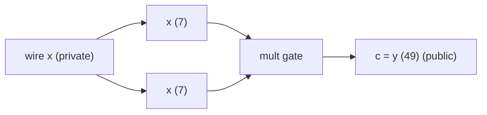
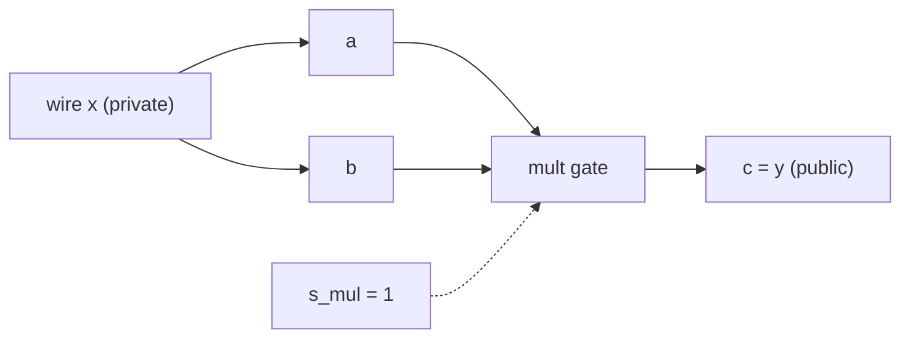

# WTF is PLONK

- were going to start with one concrete claim: prove you know `x` such that `x · x = y`, without revealing `x`

---

## Part 1 — Computation as a table (execution trace and gate constraints)

- first we want to represent our equation as a circuit, where each variable will become a wire

For `x · x = y` (`x = 7`, `y = 49`), the circuit has two logical wires and one multiplication gate:



- `x` is private — the prover knows it, the verifier must not learn it
- `y` is public — the verifier supplies `49` and checks the proof against it

- we can also organize this circuit in a more general/flexible way, using to follow the equation: 
  - `x * x = y`
  - `<-> a * b = c`
  - `<-> a * b - c = 0`
  - `<-> s_mul * (a * b - c) = 0`

- now we have a much more general multiplication gate representation where:
  - `a` and `b` are two *cells* / *inputs* (which both carry wire `x` in our case)
  - `c` is the output (in our example `c` is `y`) 
  - and `s_mul` is the selector (think of `s_mul` as a gate that enables or disables the rest of the equation, in our example it will always be enabled.), 
  
NOTE: the full plonk uses a more sophisticated version of this to support other operations, but for learning purposes, understanding a single multiplication gate will do

our circuit now looks as follows:



we can also represent our circuit as a matrix or something like a computer trace, where each row is the 'state' of the computer program, for example:

| `s_mul` | `a` | `b` | `c` | gate check `s · (a·b − c)` |
|---------|-----|-----|-----|----------------------------|
| 1 | 7 | 7 | 49 | `1 · (7·7 − 49) = 0` ✓ |
| 0 | 0 | 0 | 0 | `0 · (anything) = 0` ✓ |
| 0 | 0 | 0 | 0 | `0 · (anything) = 0` ✓ |
| 0 | 0 | 0 | 0 | `0 · (anything) = 0` ✓ |

NOTE: since we only have one gate/state, we only care about the first row (the other rows are `padded`)

- Row 0 is the only active gate: it enforces `s_mul · (a · b) = c`, i.e. `7 · 7 = 49`
- Rows 1–3 are *padding*: `s_mul = 0` turns the gate off, so those values don't matter

Using this matrix, the prover's claim is: **every row of the trace satisfies `s_mul · (a·b − c) = 0`**

## Part 2 — Identical wires must agree (copy constraints)

- notice how in our equation a and b both represent the same variable, however there are no constraints to ensure this holds.
- thats what copy constraints do
- to accomplish this we do a few things:
  - flatten the trace from N x M row/columns into a N * M x 1 vector called `Wire IDS` which label cells that must hold the same value
    - for example, in our case `WIRE_IDS = = [x, x, y, ...] = [0, 0, 1, ....]`
  - then we compute another check, that **all wire_id placements are equal inside the trace** and the public inputs (y) match too

in code, we can represent it as: 

```python
NUM_PLACEMENTS = N_TRACE_LENGTH * NUM_DATA_COLS # 4 x 3 = 12

ACTIVE_WIRE_IDS = [0, 0, 1] # flattened trace of ids: x, x, y
WIRE_IDS = ACTIVE_WIRE_IDS + [-1] * (NUM_PLACEMENTS - len(ACTIVE_WIRE_IDS))

PUBLIC_WIRES = (1,) # wire_id of y
```

- Worked example: wire 0 at placements 0 and 1 must both be `7`

| placement | cell | wire ID | trace value | copy rule |
|-----------|------|---------|---------------------------|-----------|
| 0 | row 0, `a` | 0 (`x`, private) | 7 | must equal placement 1 |
| 1 | row 0, `b` | 0 (`x`, private) | 7 | must equal placement 0 |
| 2 | row 0, `c` | 1 (`y`, public) | 49 | must equal `public_inputs[0]` |
| 3–11 | padding rows | −1 (none) | 0 | no copy checks |

- Wire 0 copy group: placements 0 and 1 both carry `x` → forces `a = b`
- Wire 1: placement 2 carries `y` → verifier checks `public_inputs[0] == 49`
- Without wire 0, a dishonest prover could set `a = 7`, `b = 8`, `c = 56` and still pass the gate

NOTE: a simple helper function going from a flat vector index to an output `(row column)` helps index inside the trace

## Proof and Verification of Gate and Copy Constraints

while theres no zk yet, we can prove everything holds by checking the trace's gates and copy constraints directly:

**1. Gate check** — loop over every row:

```python
def gate_mul(a, b, c, s):
    return s * (a * b - c)   # must be 0 mod p

def check_trace(circuit):
    for row in circuit.trace:
        if gate_mul(row[1], row[2], row[3], row[0]) != 0:
            return False
    return True
```

For our example, only row 0 matters: `1 · (7·7 − 49) = 0`. Padding rows pass because `s_mul = 0`.

**2. Copy check** — for each wire ID, all placements with that ID must agree:

```python
def check_wire_ids(circuit):
    for wire_id in {0, 1}:          # skip -1 (padding)
        placements = [p for p, wid in enumerate(WIRE_IDS) if wid == wire_id]
        if len(placements) < 2:
            continue                # wire 1 only appears once — no internal copy
        vals = [value_at_placement(circuit, p) for p in placements]
        if any(v != vals[0] for v in vals): # check all have the same value
            return False
    return True
```

Wire 0: placements 0 and 1 must both be `7`. Wire 1: only placement 2 — nothing to compare internally.

**3. Public input check** — bind what the verifier knows to the trace:

```python
def check_public_inputs(circuit, public_inputs):
    for k, wire_id in enumerate(PUBLIC_WIRES):   # PUBLIC_WIRES = (1,) → wire y
        placement = WIRE_IDS.index(wire_id)       # wire 1 lives at placement 2
        if value_at_placement(circuit, placement) != public_inputs[k]:
            return False
    return True
```

NOTE: the Verifier supplies `public_inputs = [49]`.

**Combined witness check:**

the full 'witness check' would be as follows: 

```python
def check_witness(circuit, public_inputs):
    return (
        check_trace(circuit)
        and check_wire_ids(circuit)
        and check_public_inputs(circuit, public_inputs)
    )
```

NOTE: the witness is another word for the prover's solution, which we eventually want to make private

| Check | What it catches |
|-------|-----------------|
| `check_trace` | wrong multiplication (`7·8 ≠ 56` would fail if `c` were wrong) |
| `check_wire_ids` | `a ≠ b` cheat (`7` vs `8`) |
| `check_public_inputs` | prover claims `y = 50` but trace says `49` |

This is an **honest verifier with full trace access** — the prover sends the whole table, verifier runs the three checks. 

---

## Part 3 — One polynomial per column

- now we want a faster way to evaluate the gates and copy constraints instead of just loops 
- for example, we can define `S(X), A(X), B(X), C(X)` from trace columns s_mul, a, b, and c as polynomials we want
  - we would interpolate on using x values w^i
  - and the column_i (s_i, a_i, ...) for the y values:

| Row `i` | `x_i = ω^i` | `s_mul` | `a` | `b` | `c` |
|---------|-------------|---------|-----|-----|-----|
| 0 | `1` | 1 | 7 | 7 | 49 |
| 1 | `ω` | 0 | 0 | 0 | 0 |
| 2 | `ω²` | 0 | 0 | 0 | 0 |
| 3 | `ω³` | 0 | 0 | 0 | 0 |

Note: we can use any x_i values to interpolate on (ie, {1, 2, 3, 4}), however we get some nice properties when using the roots of unity `ω^i` which we will cover later.

ie, For column `a`, values are `xs = [1, ω, ω², ω³]` and `ys = [7, 0, 0, 0]`, so we define polynomial `A(X)` with **degree < N** such that:

```
A(x_i) = a_i   for every i ∈ {0, 1, 2, 3}
```

We define the polynomial using **lagrange interpolation**: 
```
A(X) = Σ_{j=0}^{N-1} a_j · L_j(X)
```

where `x_j = ω^j` and

```
L_j(X) = Π_{m≠j} (X - x_m) / (x_j - x_m)
```

Notice how L_j(x_j) = 1 and L_j(x_m) = 0 (for m != j), so A(x_j) = a_j for all j.

Similarly define `S(X)` from selectors, `B(X)` from `b`, `C(X)` from `c`.

Now we can **redefine the constraints as one polynomial: `G(X) = S(X)·(A(X)·B(X) − C(X))`**. 

To confirm the constraints hold we just need to ensure `G(X) = 0 for all x in the domain H`. The easiest way to check this is again by loop for each x value. 

```python 
# equivalent to check_trace in previous chapter
def check_poly_trace(circuit, public_inputs):
    # compute
    S, A, B, C = interpolate_polynomials(circuit, DOMAIN)
    # verify
    for x in DOMAIN:
        if S(x) * (A(x) * B(x) - C(x)) != 0:
            return False
    return True
```

With a little more work and introducing a few more concepts, *we can actually do it with a single evaluation*.

## Vanishing polynomial

First we need to understand the vanishing polynomial `Z_H`.

On a multiplicative subgroup of order `N` we can define the vanishing polynomial as `Z_H`:

```
Z_H(X) = Π_{i=0}^{N-1} (X - ω^i) = X^N - 1
```

**Notice how `Z_H(x) = 0` for every `x ∈ H` and `Z_H(x) ≠ 0` for typical `x ∉ H`.** This will come in handy.

NOTE: the Vanishing polynomial factors to `Z_H(X) = X^N − 1` is zero exactly on `H` when using the roots of unity `ω^i`, which is why we chose them instead of a simpler `{0, 1, 2, 3}`.

In our example, `N = 4`, so:
```
Z_H(X) = X^4 - 1
```

## The Factor Theorem and The Quotient Polynomial

The main thing we need to understand is that for polynomials, the factor theorem states: 
- **for a polynomial f(x): f(a) = 0 if and only if (x−a) is a factor of f(x)**
- Another way of saying this is: **if f(a) = 0, then there exists a quotient q(x) such that, f(X) = (X − a) · q(X) for some polynomial q(X) = f(X) / (X − a)**
- Since we want to prove a polynomail `G(X) = 0` for all `x ∈ H` AND since `Z_H(X) = Π_{i=0}^{N-1} (X - ω^i)` i.e, the multiplication of `N` terms which are zero across all `x ∈ H`
  - *then* if we find a `Q(X)` such that `G(X) = Z_H(X) · Q(X)` as polynomials, then G(x) = 0 for all x ∈ H — so every gate constraint in G is satisfied at once.
- Honest witness → division succeeds; broken witness → nonzero remainder

- checking the polynomial equality can be done as follows:

```python 
G = compute_gate_poly(circuit)
Z = poly.vanishing_poly(n)
Qg, Rg = poly.div_poly(G, Z)

constraint_holds = ( # If true, G(x) = 0 for all x ∈ H
    not any(c != 0 for c in Rg)  # exact division
    and poly.eql(poly.mul_poly(Z, Qg), G) # poly equality
)
```

---

## Part 4 — Copy constraints as a permutation polynomial

- now we need to represent our copy constraints as a polynomial
- the way we do this is with a permutation σ, which **reorders the traces so copies line up**
- for example, if we have the same WIRE_ID at p0 and p1, we use a cycle between the values, then `σ(p0) = p1` and `σ(p1) = p0` (a cycle of length 2)
- our new reordered set `w^σ` would have `p1` where `p0` was and `p0` where `p1` was

For our square circuit, only wire 0 has two placements (so only one nontrivial cycle):

```
         w (values at placements)
placement p (index values):   0     1     2     3 …
value w[p]  (values in w):    7     7    49     0 …

         σ (where to look for the copy)
σ(p) (re-ordered indexs):     1     0     2     3 …

         w^σ (values after following σ)
w[σ(p)]:       7     7    49     0 …
```

Where:
- **`w`** — flat list of trace values at each placement (length 12)
- **`σ`** — permutation of placement indices; which cycles cells that share a wire ID
- **`w^σ`** — same values, reordered: `w^σ[p] = w[σ(p)]`
- Copy check: **`w[p] = w^σ[p]` for every placement `p`**

Notice how if the copy constraints are held, then `w[σ] == w`

we can then follow the procedure we using in the previous sections and create a polynomial for these two lists using the values as y-values and the roots of unity as x-values, and then ensure equality holds across the domain, that is: 
- `W(X) = W^σ(X)`
- `W(X) - W^σ(X) = 0`
- `W(X) - W^σ(X) = C(X)`

we then compute the vanishing poly: `Z_cp(X) = X^{12} − 1` and require the constraints to hold:

- `C(X) = Z_cp(X) · Q_cp(X)` (where `_cp` stands for copy)

and to prove the equality holds, we request a valid quotient polynomial `Q_cp(X)`, and do the same verification as the last section

NOTE: here `C(X)` is the **copy constraint** polynomial `W(X) − W^σ(X)`, not the trace column `C(X)`. Below we write the copy constraint as `C_cp(X)` when both appear in the same proof.

---

## Efficient Communication: KZG

- Problem: sending all polynomial coefficients is huge for real traces
- Solution: KZG commitments
  - this lets a prover say "I have a polynomial `f`" and later prove "`f(z) = y`" without sending all coefficients
- first we commit the polynomial at a secret setup point `τ` (unknown to prover and verifier after setup)
- **SETUP (trusted):** publish powers of `τ` in a group with generator `G`  
  - `SRS = { G, τG, τ²G, τ³G, …, τ^{D-1}G }`  
  - nobody keeps `τ` after this (or the scheme is broken)
- **PROVER — commit:** hide the polynomial as one group element  
  - `C = c₀·G + c₁·(τG) + c₂·(τ²G) + … = f(τ)·G`  
  - NOTE: same as evaluating `f(X) = c₀ + c₁·X + c₂·X² + …` at `X = τ`, without revealing `τ` or the coeffs  
- **VERIFIER → PROVER:** chooses a random challenge point `z` and sends it to the prover  
  - (or we can use Fiat–Shamir to have a non-interactive `z` value)
- **PROVER — open at `z`:** prove `f(z) = y` without sending all coeffs  

  - the prover must supply a valid quotient (with no remainder) for `f(x) - y / (x - z)`
    - notice the top is `g(x) = f(x) - y` which we know `z` is a root of since `g(z) = f(z) - y = y - y = 0`
    - since its a root by the factor theorem we know `(x - z)` is a factor of `g(x)`
    - and therefore there exists a quotient `g(x) / (x - z)` without remainder 
    - and this quotient would only be feasible to compute if the prover knew `f(x)`
  - so the prover computes `y` and then builds the quotient `q(X) = (f(X) − y) / (X − z)`
  - then the prover commits to the quotient: `π = q(τ)·G`
  - and sends the opening `(y, π)` to the verifier
- **VERIFIER — check opening:** does not know `τ` or the coeffs, only `C`, `z`, `y`, `π`  
  - Algebraic identity (evaluate `f(X) − y = q(X)·(X − z)` at `X = τ`):  
    ```
    f(τ) − y = q(τ) · (τ − z)
    <-> f(τ) − y = (f(τ) - y) / (τ - z) · (τ − z)
    <-> f(τ) − y = (f(τ) - y)
    <-> 0 = 0
    ```  
  
- **Why this works**  
  - honest prover who knows `f` and sets `y = f(z)` can always form exact `q` and pass  
  - cheater with wrong `y` has nonzero remainder → no polynomial `q` → can't produce a valid `π` except with negligible probability  
  - coefficients stay hidden: only `C`, `y`, and `π` leave the prover  

```python
def prove_open(coeffs, z, setup):
    y = eval_poly(coeffs, z) # f(z)
    q, r = div_poly(sub_poly(coeffs, [y]), [mod(-z), 1])  # (f - y) / (X - z)
    assert r == [0]
    pi = eval_poly(q, setup["tau"]) # q(τ)
    return y, pi

def verify_open(C, z, y, pi, setup):
    return (C - y) == (pi * (setup["tau"] - z))
```

## PLONK Prove/Verify Pipeline

To put it together, we run KZG on every polynomial we built, then check gate and copy identities **at one challenge point `z`**.

### Polynomials we commit

| Commitment | Polynomial | Definition |
|------------|------------|------------|
| `Commit(S)` | `S(X)` | selector column |
| `Commit(A)` | `A(X)` | left input column |
| `Commit(B)` | `B(X)` | right input column |
| `Commit(C)` | `C(X)` | output column |
| `Commit(G)` | `G(X)` | `S(X)·(A(X)·B(X) − C(X))` |
| `Commit(Q)` | `Q(X)` | gate quotient: `G(X) = Z_H(X) · Q(X)` |
| `Commit(C_cp)` | `C_cp(X)` | copy constraint: `W(X) − W^σ(X)` (Part 4’s `C(X)`) |
| `Commit(Q_cp)` | `Q_cp(X)` | copy quotient: `C_cp(X) = Z_cp(X) · Q_cp(X)` |

Vanishing polys (not committed — verifier can evaluate them):

- `Z_H(X) = X^4 − 1` (zero on row domain `H`)
- `Z_cp(X) = X^{12} − 1` (zero on placement domain)

- we then follow the ZKG algorithm for each of the polynomials, proving each polynomial is honest without revealing the value itself

---

## How this differs from "real" PLONK (honest map)
- General gate gadget: `q_L·A + q_R·B + q_M·AB + q_O·C + q_C` (five selector polys in VK)
- Tutorial shortcut: one mul gate → `G(X) = S(X)·(A(X)·B(X) − C(X))`
- Real copy argument: grand product polynomial + challenges `β, γ` (not explicit `W − W^σ` / `C_cp`)
- Constraint folding: random `α` combines `G`, `C_cp`, … into one grand quotient (we keep `Q` and `Q_cp` separate)
- Curves + pairings instead of field-element `f(τ)`
- FFT/NTT for `N = 2^{20}`, not `N = 4`
- Same skeleton everywhere: **trace → constraints → quotients → commit → challenge → open → verify**
